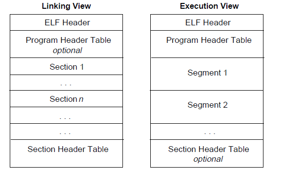
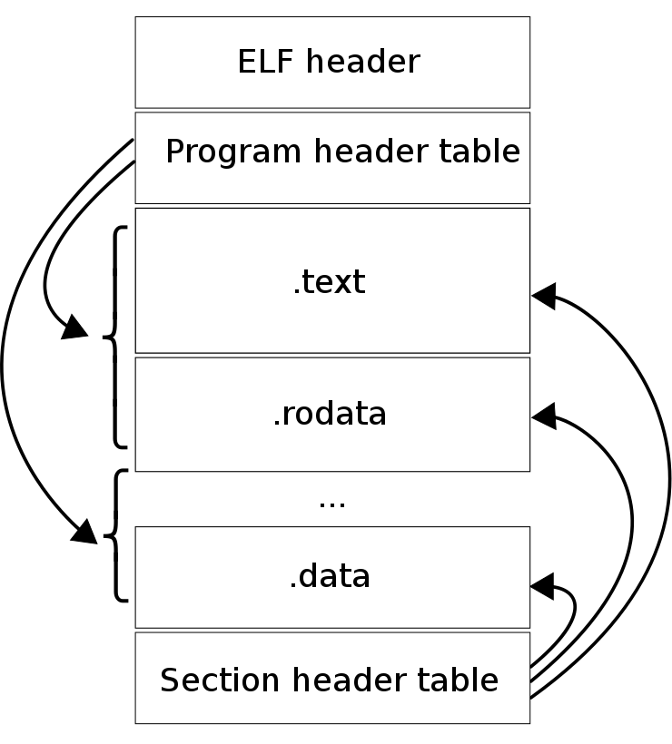

# 项目介绍


## 目录

[C++高性能服务器框架](#C++高性能服务器框架)

[基于签名技术的Linux软件保护](#基于签名技术的Linux软件保护)

[基于Flex和Bison的科学计算器](#基于Flex和Bison的科学计算器)

[Android校园交通助手](#Android校园交通助手)

---

## C++高性能服务器框架

这个项目参照于一个非常出名的开源TCP网络编程库，Muduo（ A Event-driven network library for multi-threaded Linux server in C++11），整个项目使用C++11进行编写和重构，一方面是出于学习[C++11中的一些新特性](./C++ interview.md)的目的，另一方面也是为了熟悉一下Linux下的网络编程会涉及到的API以及相关知识。

本项目采用的是主从Reactor多线程模式，这也是大多数高性能服务器采用的模式。在这个模式中，服务器以事件驱动作为核心，服务器线程只负责mainReactor的新建连接任务，同时维护一个线程池，每一个线程也是一个事件循环，新连接建立后分发给一个subReactor开始事件监听，有事件发生则在当前线程处理。这种模式几乎是目前最先进、最好的服务器设计模式。

在开始写这个项目的时候，我是将所有文件都放在一个文件夹内，也没有进行分类，当然虽然整个项目模块的增多以及复杂性的提高，我会将不同模块拆分到不同文件夹，将头文件统一放在一起。然后再通过一些工具去实现整个C++项目的工程化，首先就是使用CMake来管理项目，自动生成Makefile文件，使项目的编译链接更加容易。

配置好Cmake后，我还通过一些额外的工具，比如format、cpplint和clang-tidy去优化整个项目代码的结构和风格。

1. format：作为一个大型C++项目，可能有许多程序员共同开发，每个人的编码习惯风格都不同，整个项目可能风格杂乱，可读性差，不利于项目维护。所以在写C++代码时应该遵守一些约定，使代码的风格统一。目前比较流行的C++代码风格有google、llvm等，本项目采用google风格。

2. cpplint：基于google C++编码规范的静态代码分析工具，可以查找代码中错误、违反约定、建议修改的地方。

3. clang-tidy：clang编译器的代码分析工具，功能十分强大。既可以查找代码中的各种静态错误，还可以提示可能会在运行时发生的问题。不仅如此，还可以通过代码分析给出可以提升程序性能的建议。

这三件事可以保证我们写出风格一致、bug较少、性能较好、遵守google编码规范的项目，是开发大型C++项目必备的利器。

为了很方便地自动一键运行，这三个工具都已经以`python`脚本的格式保存在了`build_support`目录。应用这些工具给我们提供的现代C++项目建议，项目性能有了明显提高。比如所有的类都被声明为不可拷贝、不可移动。clang-tidy提示的按值传参也被修改为引用传参，减少了大量的复制操作。这些工具建议的修改都大大降低了bug发生的几率、提高了服务器性能，虽然还没有用任何的性能测试工具，服务器的处理速度、吞吐量、并发支持度都明显提高了。


```c++
int main() {
    EventLoop *loop = new EventLoop();//EventLoopl
    Server *server = new Server(loop);
    loop->loop();
    delete server;
    delete loop;
    return 0;
}
Server::Server(EventLoop *_loop) : loop(_loop), acceptor(nullptr){ 
    acceptor = new Acceptor(loop);
    std::function<void(Socket*)> cb = std::bind(&Server::newConnection, this, std::placeholders::_1);
    acceptor->setNewConnectionCallback(cb);
}

void Server::newConnection(Socket *sock){
    Connection *conn = new Connection(loop, sock);
}

Connection::Connection(EventLoop *_loop, Socket *_sock) : loop(_loop), sock(_sock), channel(nullptr), inBuffer(new std::string()), readBuffer(nullptr){
    channel = new Channel(loop, sock->getFd());
}

void Channel::handleEvent(){
    loop->addThread(callback);
}

void Channel::enableReading(){
    events |= EPOLLIN | EPOLLET;
    loop->updateChannel(this);
}

Acceptor::Acceptor(EventLoop *_loop) : loop(_loop), sock(nullptr), acceptChannel(nullptr){
    sock = new Socket();
    InetAddress *addr = new InetAddress("127.0.0.1", 1234);
    sock->bind(addr);
    sock->listen(); 
    sock->setnonblocking();
    acceptChannel = new Channel(loop, sock->getFd());
    std::function<void()> cb = std::bind(&Acceptor::acceptConnection, this);
    acceptChannel->setCallback(cb);
    acceptChannel->enableReading();
    delete addr;
}
```


---

## 基于签名技术的Linux软件保护

### 简介：

实现一个Linux下的二进制签名和验证程序，用于在Linux系统上进行应用的标识和管理，提升应用程序的可追溯性和安全性鉴别能力。

### 要求：

对于Linux下给定的ELF可执行程序、自行开发签名工具对程序的代码段（Load Segment）首先进行散列，然后对散列值进行签名，签名数据应作为单独的节（Section）附加到原ELF可执行程序的尾部。同时，应开发验证软件并加入操作系统，在运行任何ELF可执行程序前对ELF文件进行验证，若ELF可执行程序没有被签名或者签名验证失败则应停止运行本程序，若签名验证成功则可以正常运行。

- 签名后的ELF可执行程序可正常运行在带有签名验证的Linux操作系统上，以及不带有签名验证机制的Linux操作系统上；

- 签名后的ELF可执行程序中的签名数据节应可通过readelf与objdump等程序解析得到正确的值；
- 运行ELF可执行程序的方式应保持不变，不得通过其他程序运行ELF可执行程序的方式验证签名；
- 签名验证所需要的公钥、证书以及验证程序可以预先设置在操作系统中；完成基于公私钥的验证程序，能透明地对任意ELF程序在运行前进行签名验证，签名验证通过的可以正常运行，未通过的不允许运行，对比未实施签名验证前的程序启动时间延迟不超过10%。
- 本题不考察选手对加密算法的实现，因此选手可以选择开源的加密软件库进行加密，但是对应强度应不低于RSA2048；
- 不修改内核源码，开发外置内核模块挂钩Linux内核的进程启动流程作为验证程序。

实现程序主要涉及**对ELF可执行格式的理解、Linux操作系统下程序运行的机制的理解，以及对加密算法的运用**。

### 实现：
[1. ELF文件解析模块](####1. ELF文件解析模块)、[2. ELF文件读写模块](####2. ELF文件读写模块)、[3. RSA相关的签名算法模块](####3. RSA相关的签名算法模块)、[4. 验证模块（将验证程序封装为内核模块）](####4. 验证模块（将验证程序封装为内核模块）)

#### **1.  ELF文件解析模块**

该模块主要功能为：从指定的ELF文件中加载**所有的Load Segment**。将所有的Load Segment读入并做Hash。

事实上所有对ELF读写相关的核心操作几乎都在对ELF Header与Program Header Table以及Section Header Table的解析上，我们首先来简单介绍一下ELF文件的格式。

ELF文件的宏观结构大概如下图所示：

ELF文件有两种视图，一种是链接版，一种是执行版。链接版主要由section构成，运行版则主要有segment构成。那么section和segment的区别是什么？ 实际上segment由section构成，在映射到虚拟内存中后，就是我们常说的data segment，code segment之类的。



可以看到Program Header Table主要和segment有关，section header table则存储了每个section相关的表项。而ELF header则存储了ELF的相关信息，比如代码段入口，section的数目，section header的offset之类的。所以这里我们主要关心section相关的结构。



#### **2. ELF文件读写模块**

该模块应当有两个功能：

-    可读任意section的内容

-    可新建一个section用来存放签名

关于section的解析，我们主要需要分析 ELF Header 与 Section Header Table。ELF Header 描述了 ELF 文件的概要信息，利用这个数据结构可以索引到 ELF 文件的全部信息。

这一步的目标是向ELF中插入一个section，那么首先要清楚ELF是怎么存储并识别section的，按照开发者的思路，我们很容易想到我们可以把每个section的信息和特征抽象成一个struct，然后把所有的struct存入一个数组，最后把数组的地址放入ELF Header就可以了。这样我们就可以直接通过ELF Header来获得section struct数组，进而间接获得section的信息。其实上面这几个字段的作用便是如此。存储struct的数组就是上面提到的Section Header Table，在ELF文件的末尾。

#### **3. RSA相关的签名算法模块**

这一部分相对比较简单，只是简单的封装了一下openssl中关于RSA（非对称的加密算法）以及X509的相关api，生成一对公私钥或者是一个私钥和X509证书。最后使用生成的**私钥进行签名**，使用**公钥或者X509证书进行验证**。

#### **4. 验证模块（将验证程序封装为内核模块）**

**验证程序做的事：**对ELF文件进行解析，读入所有的Load Segment进行散列得到一段`摘要`，再读文件末尾我们新添加的签名section，获得数字签名，最后调用RSA验证函数，使用公钥对这个签名以及得到的摘要进行验证。

**第二步：**开发外置内核模块将上面的验证程序挂钩在Linux内核的进程启动流程中，控制ELF文件的运行。

**hook 钩子函数：**当内核程序已经在运行过程中，如果需要对某个内核函数做出小的改动，比如说在内核中有一个函数，我们想截断他的执行流程，比如说对某文件的读操作。原始方法是修改内核源码或驱动程序，重新编译在加载二进制文件，而内核重新编译、重启设备代价非常大。第二种方式就是，通过插入一个钩子函数，可以截断程序正常的执行流程，做自己的想做的操作，可以仅仅只做一个监控，也可以彻底截断函数的执行。

**注意：**为了更好的展示demo的运行，通过限制work dir。需要切换`LIMITED_DIR`到测试目录。然后所有处于`LIMITED_DIR`的ELF文件都会被钩住！首先调用我们编写的验证程序，执行上述所描述的操作，如果结果返回验证通过，再通过`real_sys_execve`函数去执行我们的原ELF文件。

---

## Nginx

nginx是一款轻量级的Web 服务器 、反向代理服务器及电子邮件（IMAP/POP3）代理服务器。主要有反向代理，负载均衡的功能。

#### 1. Nginx的常用功能

##### 反向代理：

这是 Nginx 服务器作为 WEB 服务器的主要功能之一，**客户端向服务器发送请求时，会首先经过 Nginx 服务器，由服务器将请求分发到相应的 WEB 服务器**。**正向代理是代理客户端**，而**反向代理则是代理服务器**，Nginx 在提供反向代理服务方面，通过使用正则表达式进行相关配置，采取不同的转发策略，配置相当灵活，而且在配置后端转发请求时，完全不用关心网络环境如何，可以指定任意的IP地址和端口号，或其他类型的连接、请求等。

##### 负载均衡：

**将服务器接收到的请求按照规则分发的过程。**这也是 Nginx 最常用的功能之一，负载均衡，一方面是将单一的重负载分担到多个网络节点上做并行处理，每个节点处理结束后将结果汇总返回给用户，这样可以大幅度提高网络系统的处理能力；**另一方面将大量的前端并发请求或数据流量分担到多个后端网络节点分别处理，这样可以有效减少前端用户等待相应的时间。**而 Nginx 负载均衡都是属于**后一方面**，主要是对大量前端访问或流量进行分流，已保证前端用户访问效率，并可以减少后端服务器处理压力。

weight轮询（默认）、ip_hash: 每个请求按照发起客户端的ip的hash结果进行匹配、fair: 智能调整调度算法，动态的根据后端服务器的请求处理到响应的时间进行均衡分配、url_hash: 按照访问的url的hash结果分配请求。

##### Web缓存：

在很多优秀的网站中，Nginx 可以作为前置缓存服务器，它被用于缓存前端请求，从而提高 Web服务器的性能。**Nginx 会对用户已经访问过的内容在服务器本地建立副本**，这样在一段时间内再次访问该数据，就不需要通过 Nginx 服务器向后端发出请求。减轻网络拥堵，减小数据传输延时，提高用户访问速度。

## 基于Flex和Bison的科学计算器

## Android校园交通助手
